# { prompt: {Bot} } ChatBot UI

[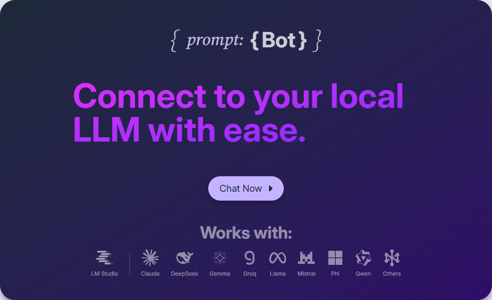](https://cmorman89.github.io/local-ai-chatbot)

## Overview:

{ prompt: {Bot} } is a React-based web application that provides a user interface for interacting with a local LLM (Large Language Model) server using LM Studio as the backend. Built with a modern and highly-interactive UI, it allows a user to easily ask questions and review chat history like most chat interfaces. However, prompt:Bot gets its name from the ability to modify the system prompt on-the-fly, along with the user prompt. This gives more flexibility and control over the conversation, allowing the user to experiment with and fine-tune the model's responses.

### Try it yourself [here](https://cmorman89.github.io/local-ai-chatbot)!

## Key Features

1. **Chat Interface** – The heart of the app is its chat system, which includes user and AI-styled chat bubbles. It supports markdown rendering (using `react-markdown` and `rehype-highlight`) for improved readability. The chat input dynamically resizes and provides real-time feedback, making interactions more fluid.

2. **Model Management** – Users can choose from a list of models hosted on the backend server. The selection menu displays each model in a visually distinct card, with unique icons and colors to differentiate architectures. The selected model persists across sessions via local storage.

3. **System Prompt Customization** – A standout feature is the ability to modify the system prompt on the fly. This allows users to tweak the AI’s behavior without restarting the session, making it easy to experiment and refine responses.

4. **Server Configuration** – The settings menu lets users customize the backend server’s protocol, hostname, and port, ensuring compatibility with various setups—whether local or remote.

5. **Dark Mode** – A built-in dark mode toggle enhances readability in different lighting conditions. Implemented with Tailwind CSS, this preference is also saved in local storage for consistency across sessions.

## Screenshots:

### Chat Interface:

|  |  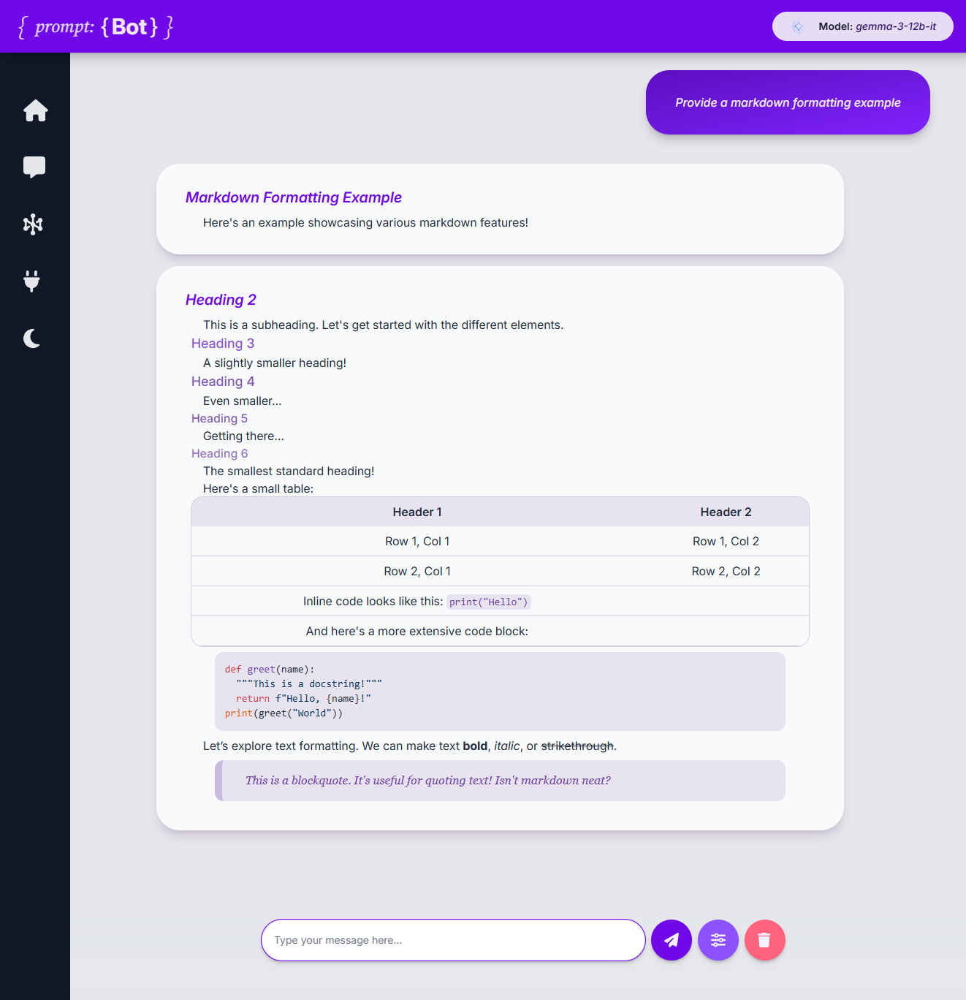  |
| :-------------------------------------------: | :------------------------------------------------------------: |
|               _New chat prompt_               | _Chat with dynamic markdown rendering. Using `gemma-3-12b-it`_ |
|   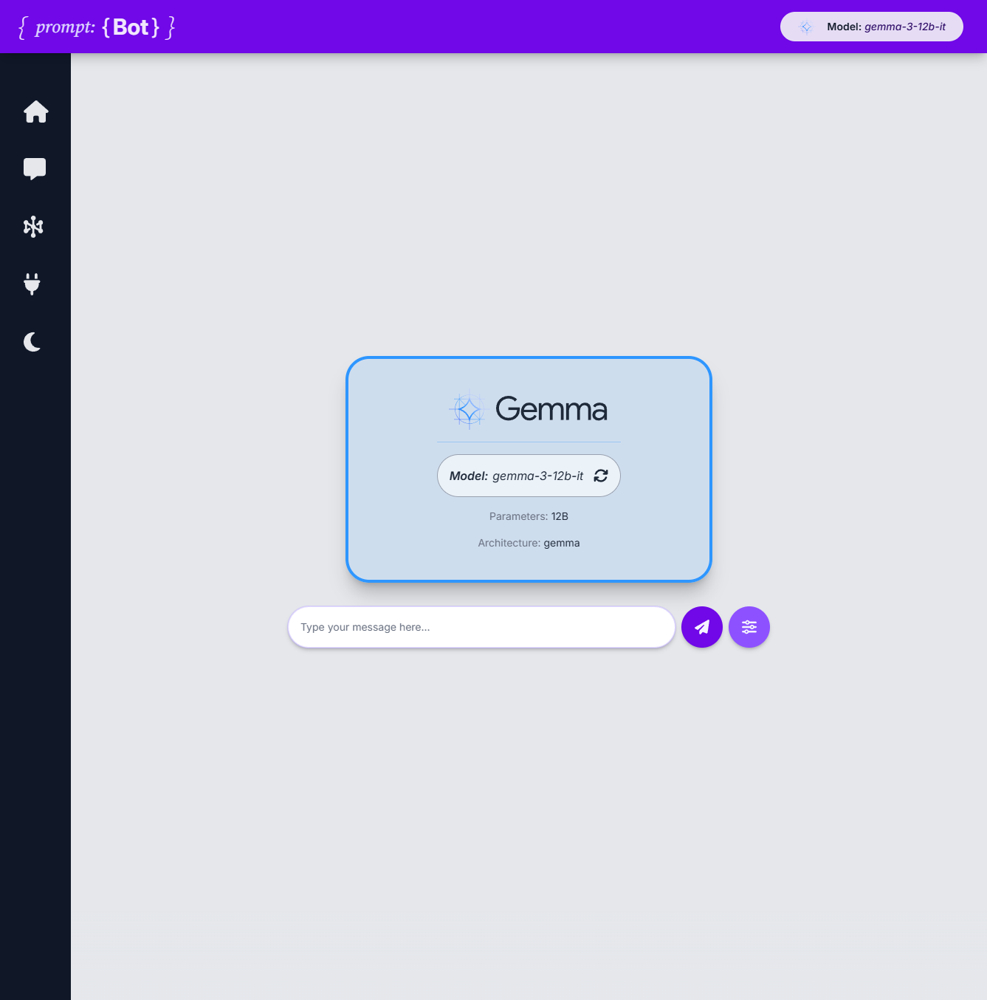    |     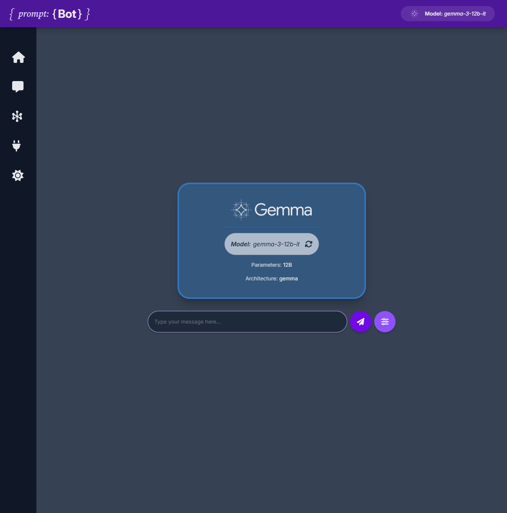      |
|                 _Light mode_                  |                          _Dark mode_                           |

---

### Styled Model Cards

|    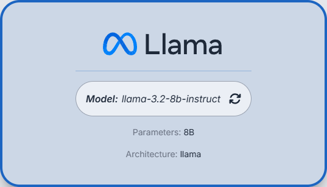    |     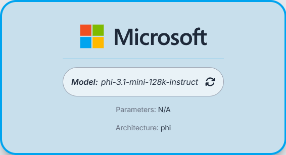     |
| :----------------------------------------------------------: | :--------------------------------------------------------: |
|                      _Llama chat intro_                      |                      _Phi chat intro_                      |
|    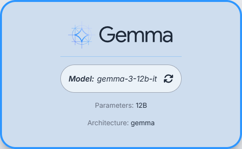    | 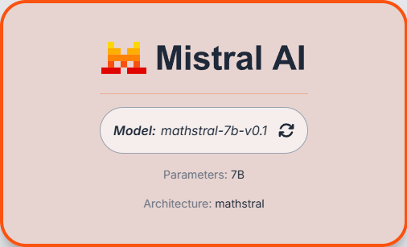 |
|                      _Gemma chat intro_                      |                    _Mistral chat intro_                    |
| 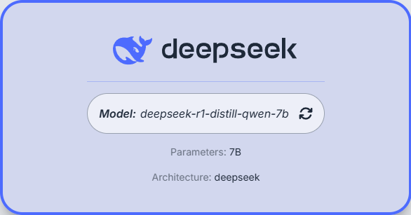 |    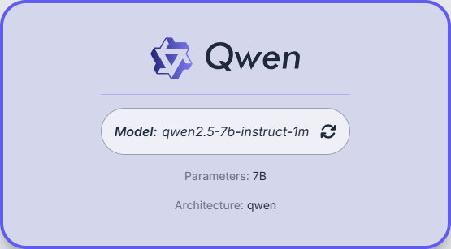    |
|                    _DeepSeek chat intro_                     |                     _Qwen chat intro_                      |
|   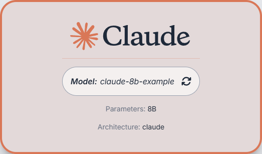   |    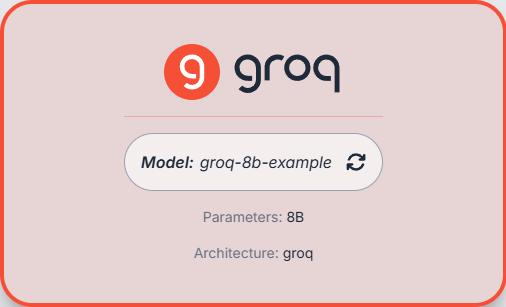    |
|                     _Claude chat intro_                      |                     _Groq chat intro_                      |
|   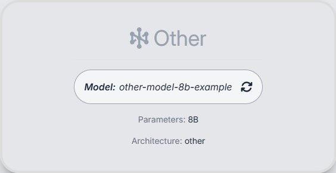   | 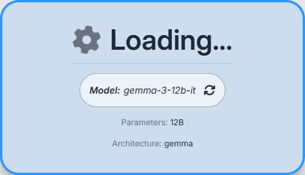 |

### Menus

|   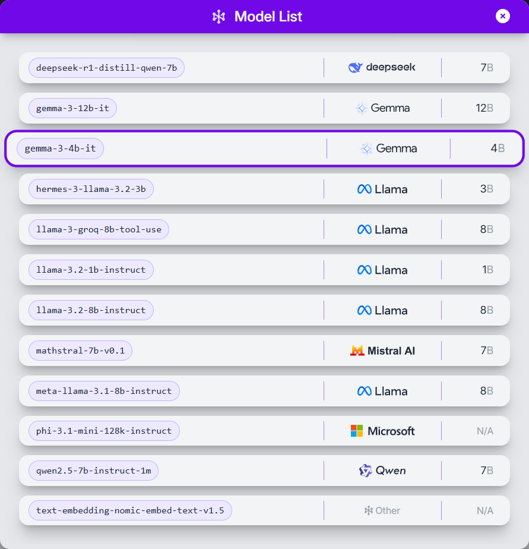    | 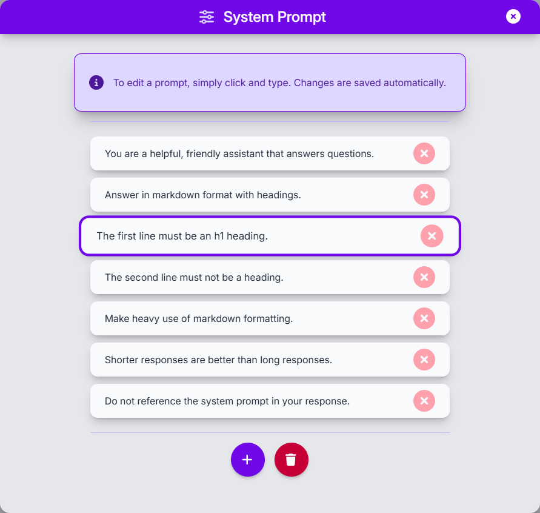 |
| :--------------------------------------------------: | :--------------------------------------------------------: |
|                _Model selection menu_                |                    _System prompt menu_                    |
| 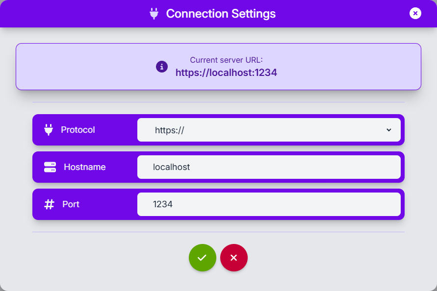 |                                                            |
|                  _Connection menu_                   |                                                            |

## Technical Details

The `{ prompt: {Bot} }` application is built to provide a smooth and intuitive way to interact with local Large Language Models (LLMs). It features a React-based frontend that delivers a fast, interactive experience. The app communicates with a backend LLM server, like LM Studio, via RESTful APIs to retrieve model information, send user prompts, and handle streaming responses.

### Dependencies

- React
- React Router DOM
- Tailwind CSS
- FontAwesome
- Framer Motion
- React Markdown with Remark GFM and Rehype Highlight
- Highlight.js
- Axios
- ESLint with React and React Hooks plugins
- Vite for development and build

### Why These Choices?

- **React Frontend** – React’s component-based architecture and state management make it ideal for a dynamic UI without having to mess with lots of JavaScript. I also wanted to try out React.
- **Tailwind CSS** – Its utility-first approach speeds up development and ensures a clean, responsive design without context switching.
- **Markdown Support** – Markdown rendering enhances AI-generated content, especially code snippets and lists. It allows easy, rule-based formatting of text, making the chat interface more readable and engaging.
- **Streaming Responses** – The app supports real-time streaming responses from the backend via a `useStreamingChat` custom hook, making conversations feel more natural.
- **Local Storage** – Preferences like selected model, server settings, and dark mode persist across sessions for a seamless experience.
- **Robust Error Handling** – Thoughtful error handling ensures smooth performance, even if API requests fail or server configurations are incorrect.
