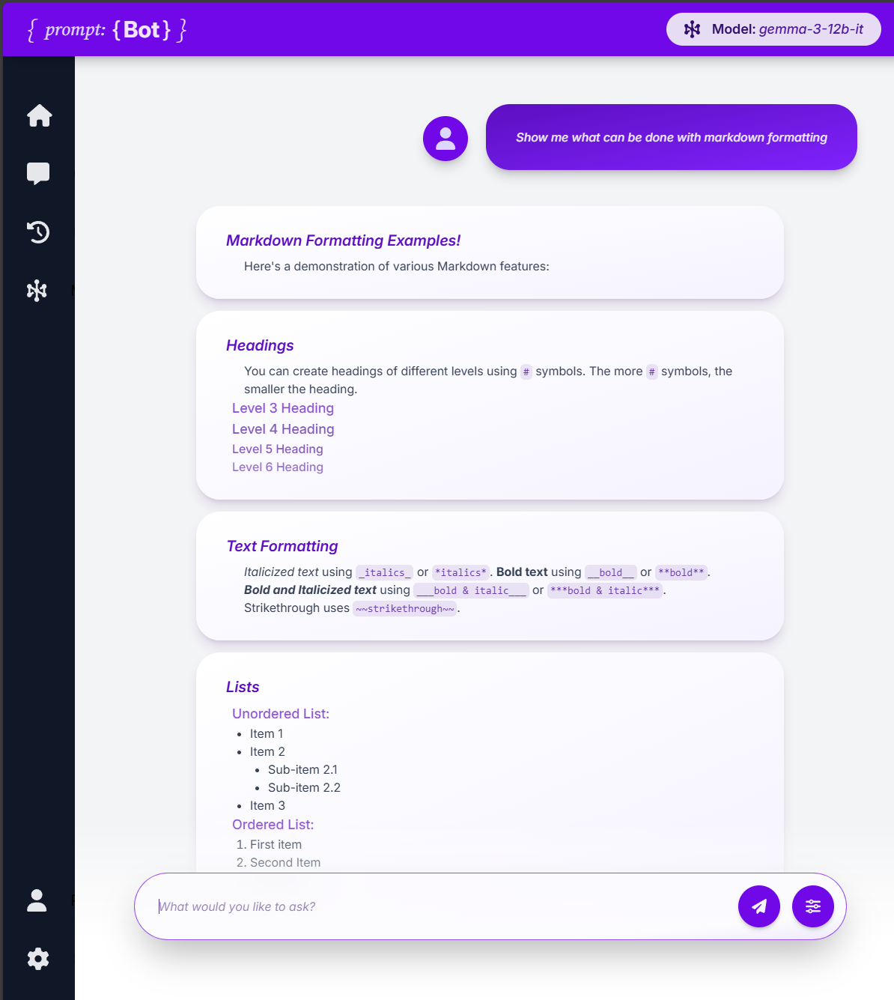
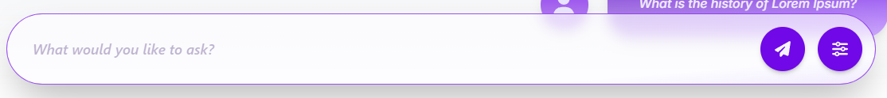
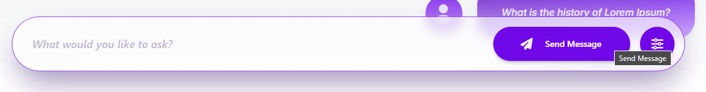
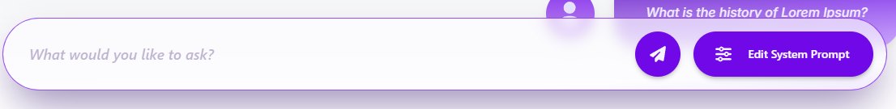

# { prompt: {Bot} } ChatBot UI

## Overview:

{ prompt: {Bot} } is a React- and Flask-based web application that provides a user interface for interacting with a local LLM (Large Language Model) server suchas LM Studio. Built with a modern and highly-interactive UI, it allows a user to easily ask questions and review chat history like most chat interfaces. However, prompt:Bot gets its name from the ability to modify the system prompt on-the-fly, along with the user prompt. This gives more flexibility and control over the conversation. allowing the user to fine-tune the model's responses.

## Features:
- Interact with a local LLM server
- User and AI-styled chat bubbles with dynamic markdown rendering
## Screenshots:

Chat Interface:

|  |
|:--:|
| *Chat window with dynamic markdown rendering. Using `gemma-3-12b-it`* |

Dynamic Buttons:

