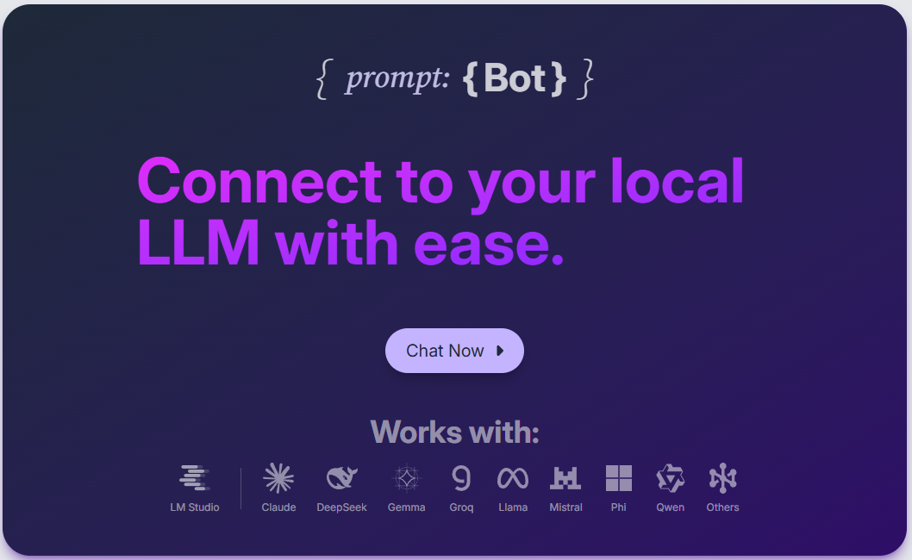
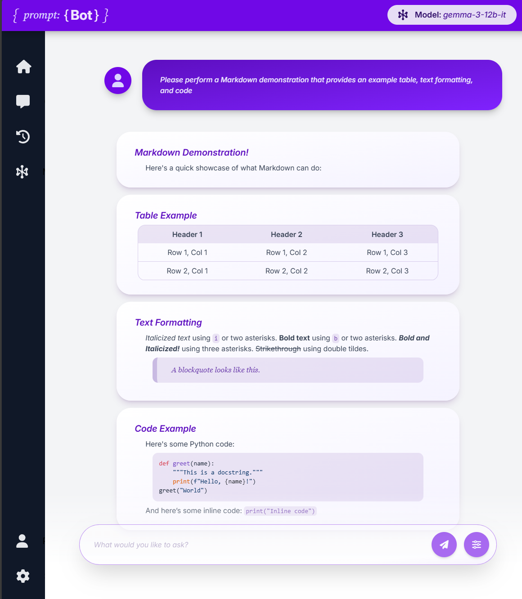
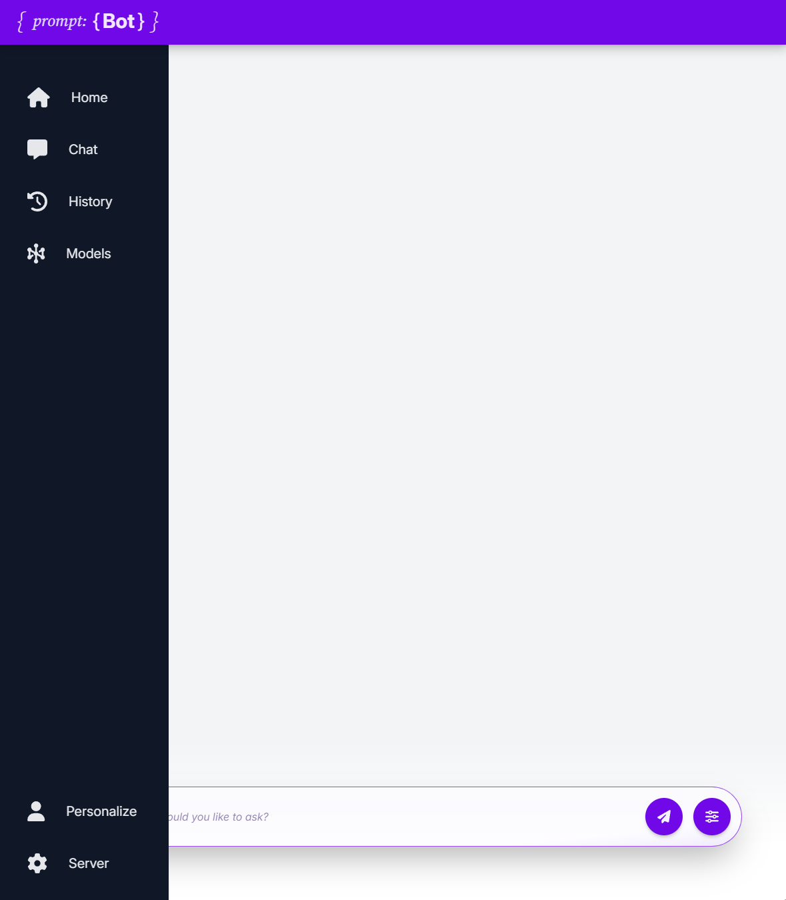
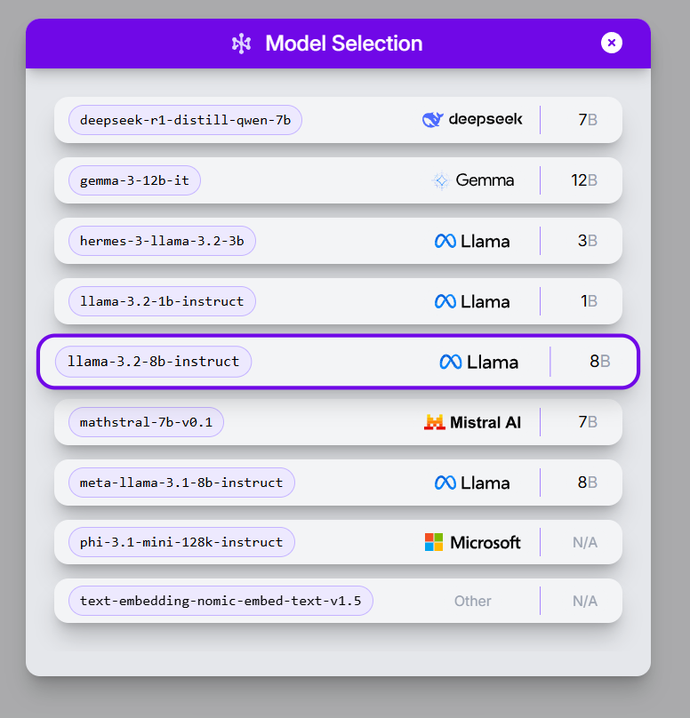
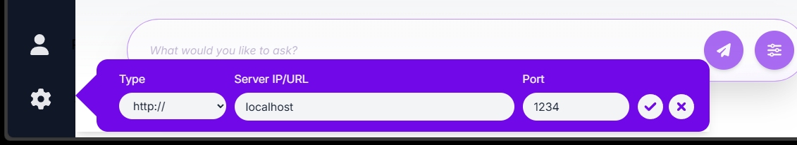
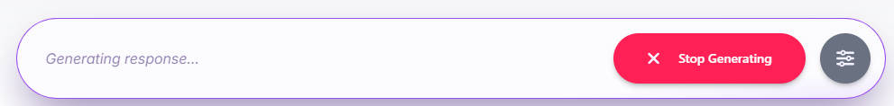

# { prompt: {Bot} } ChatBot UI

## Overview:

{ prompt: {Bot} } is a React-based web application that provides a user interface for interacting with a local LLM (Large Language Model) server such as LM Studio. Built with a modern and highly-interactive UI, it allows a user to easily ask questions and review chat history like most chat interfaces. However, prompt:Bot gets its name from the ability to modify the system prompt on-the-fly, along with the user prompt. This gives more flexibility and control over the conversation, allowing the user to fine-tune the model's responses.

### Try it yourself [here](https://cmorman89.github.io/local-ai-chatbot)!

## Features:

- Interact with a local LLM server (e.g., LM Studio)
- User and AI-styled chat bubbles with dynamic markdown rendering
- Conversational/contextual chat history
- Select a different model to load and use
- Select custom server endpoint

## Screenshots:

Chat Interface:
|  |
|:--:|
| _Chat window with dynamic markdown rendering. Using `gemma-3-12b-it`_ |

Interactive Menu:

Model Selection:

Server Selection:

Dynamic Buttons:

